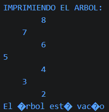
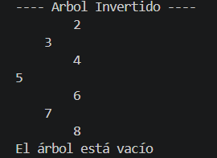
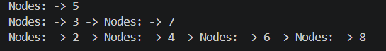

## EJERCICIOS DE LOGICA CON ESTRUCTURA DE DATOS.
Nombre del Estudiante: David Fajardo

Descripción general:

Se abordaron las distintas aplicaciones de la recursividad en el uso de arboles. Creando metodos que agregan datos de manera secuencial y automática según un orden pre definido, además de coperar para realizar impresiones de vistas a forma de arbol, con los datos ingresados. Las colas tambien se usaron durante el proyecto, siendo su principal utilidad en los ejercicios, el permitir mostrar los distintos niveles de un arbol.

Explicación Ejercicio 1:

El ejercicio incia por instanciar un arbol binario, recurriendo al metodo recursivo AddRecursivo, que agrega segun el criterio definido, a la izquierda o derecha un elemento. Al finalizar este proceso se usa la raiz del arbol como parametro para los metodos de impresion recursivos, que verifican el estado de los hijos antes de realizar una accion, hasta encontrar una hoja, donde finalmente imprimen el resultado con los metodos print.
Este proceso se realizo con la finalidad de obtener una impresion en forma de arbol horizontal.

Los codigos responsables de esta ejecucion se detallan de la siguiente manera:
public void printTree(Nodes<Integer> root){
    System.out.println("IMPRIMIENDO EL ARBOL: ");
    printTreeRecursivo(root,0);
}
private void printTreeRecursivo(Nodes<Integer> root, int nivel) {
    if(root == null)
    return ;
    printTreeRecursivo(root.getRight(),nivel+1);
    for(int i = 0; i< nivel;i++){
        System.out.print("    ");
    }
    System.out.println(root.getValue());
    printTreeRecursivo(root.getLeft(),nivel+1);  
}

Resolucion del ejercicio 2:

El ejercicio 2 buca imprimir o mostrar un arbol de manera invertida. El arbol original se recorre de derecha a izquiera, pero para imprimirlo de manera inversa se realiza el recorrido en sentido contrario. Hasta llegar al caso base, donde se realizan las impresiones de las ramas y hojas, terminando con una forma invertida.

public void printInvertido(Nodes<Integer> root){
    System.out.println("IMPRESION ARBOL VERTICAL");
    printInvertirRecursivo(root,0);
}
private void printInvertirRecursivo(Nodes<Integer> root, int nivel){
    if (root == null) {
        return;  
    }
    printInvertirRecursivo(root.getLeft(), nivel+1);
        for (int i = 0; i < nivel; i++) {
        System.out.print("    ");
    }
    System.out.println(root.getValue());
    printInvertirRecursivo(root.getRight(), nivel+1);
}

Resolucion del ejercicio 3:

El ejercicio funciona bajo una logica estructural, recorre todo el arbol por secciones, o niveles, almacenando todos los nodos que se ubicen en una seccion especifica, por grupos en una lista aparte. El metodo extrae los nodos, con el comando pull que elimina el dato una vez extraido. Una vez termina proporciona los nodos por secciones.

public List<List<Nodes<Integer>>> listLevels(Nodes<Integer> root) {

        List<List<Nodes<Integer>>> resultado = new ArrayList<>();

        if (root == null) {
            return resultado;
        }

        Queue<Nodes<Integer>> cola = new LinkedList<>();
        cola.add(root);

        while (!cola.isEmpty()) {

            int tamaño = cola.size();
            List<Nodes<Integer>> nivel = new ArrayList<>();

            for (int i = 0; i < tamaño; i++) {

                Nodes<Integer> actual = cola.poll();
                nivel.add(actual);

                if (actual.getLeft() != null) {
                    cola.add(actual.getLeft());
                }

                if (actual.getRight() != null) {
                    cola.add(actual.getRight());
                }
            }

            resultado.add(nivel);
        }

        return resultado;
    }

Resolucion del ejercicio 4:

El metodo recursivo primero verifica que existan elementos en el arbol antes de comenzar el proceso, llamandose a si mismo hasta llegar a las hojas, retorna la cantidad de profundidad en las dos ramas, el metodo math es el que retorna en base al resultado de la recursion, el mayor elemento, sumando uno para incluir el nodo inicial del cual parten los datos. 

Conclusiones:

Los ejercicios demuestran la utilidad de la recursividad en estructuras no lineales, por su eficiencia al recorrer arboles de manera encilla, siplificando codigo largo en solo unas pocas lineaas.
La implementacion de las colas para recorrer niveles, mostrando en escencia, como las estructuras lineales pueden complementar procesos no lineales referente a la organizacion y visualizacion de estructuras.

Recomendaciones:

La principal recmendacion seria incluir el manejo de exepciones en las partes de codio que pueden romperse en donde ocurre un error.

Observaciones:

La recursividad funciona de buena manera en arboles pequeños como los del ejercicio, pero pueden dar problemas de rendimiento en secciones mas grandes

link del repositorio:

https://github.com/David-Fajardo-LN/icc-est-u2-EjerciciosArboles.git
